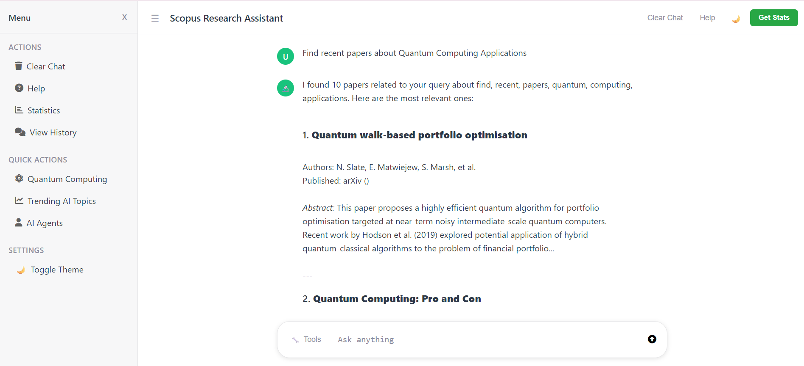

# Scopus Chatbot


[](https://github.com/yassinejador/scopus-chatbot/actions/workflows/python-ci.yml)


## Project Overview

The Scopus Chatbot is an intelligent conversational agent designed to provide users with information extracted from the arXiv database. It allows users to query research papers, authors, and other academic data through a natural language interface. The chatbot leverages advanced techniques in natural language processing (NLP), semantic indexing, and data management to deliver accurate and relevant responses. While the application was initially named 'Scopus Chatbot' and its database schema is based on Scopus result columns, the underlying data source has transitioned from the Scopus API to the arXiv API. This means that all research data retrieved and processed by the application now originates from arXiv. The system internally converts arXiv data fields to fit the existing Scopus-based database relationships and structure, ensuring seamless operation without requiring changes to the application's core logic or user interaction methods.

## Table of Contents

*   [Project Overview](#project-overview)
*   [Features](#features)
*   [Project Structure](#project-structure)
*   [Project Architecture Breakdown](#project-architecture-breakdown)
    *   [1. High-Level Architecture](#1-high-level-architecture)
    *   [2. Component Breakdown](#2-component-breakdown)
        *   [2.1. Web Interface (`web_interface/`)](#21-web-interface-web_interface)
        *   [2.2. Chatbot Core (`chatbot_core/`)](#22-chatbot-core-chatbot_core)
        *   [2.3. Data Management (`data_management/`)](#23-data-management-data_management)
        *   [2.4. Semantic Indexing (`semantic_indexing/`)](#24-semantic-indexing-semantic_indexing)
    *   [3. Configuration and Utilities](#3-configuration-and-utilities)
    *   [4. Data Storage](#4-data-storage)
*   [Setup and Installation](#setup-and-installation)
    *   [1. Clone the Repository](#1-clone-the-repository)
    *   [2. Create a Virtual Environment (Recommended)](#2-create-a-virtual-environment-recommended)
    *   [3. Install Dependencies](#3-install-dependencies)
    *   [4. Configure Environment Variables](#4-configure-environment-variables)
    *   [5. Prepare Data (Initial Data Loading and Indexing)](#5-prepare-data-initial-data-loading-and-indexing)
    *   [6. Run the Chatbot](#6-run-the-chatbot)
*   [Codebase Documentation](#codebase-documentation)
*   [Testing](#testing)
    *   [Test Location](#test-location)
    *   [Running Tests Locally](#running-tests-locally)
    *   [Running Tests with GitHub Actions (CI/CD)](#running-tests-with-github-actions-cicd)
*   [User Guide](#user-guide)
*   [License](#license)
## Features

*   **Natural Language Understanding:** Process and interpret user queries in natural language.
*   **arXiv Data Integration:** Connects to the arXiv API to retrieve up-to-date academic information, with internal conversion to fit the Scopus-based database schema.
*   **Semantic Search:** Utilizes vector embeddings and FAISS indexing for efficient and relevant information retrieval.
*   **Modular Architecture:** Designed with distinct components for easy maintenance and scalability.
*   **Web Interface:** Provides a user-friendly web-based interface for interaction.

## Project Structure

The project is organized into several key directories, each responsible for a specific part of the chatbot's functionality:

```
scopus_chatbot/
├── chatbot_core/             # Core logic for query processing and response generation
├── data/                     # Stores database, vector index, and embeddings cache
├── data_management/          # Handles arXiv API interaction, data cleaning, and database management
├── semantic_indexing/        # Manages embedding generation and vector indexing
├── web_interface/            # Frontend web application (Flask)
├── tests/                    # Unit tests (Pytest)
├── config.py                 # Configuration settings
├── main.py                   # Main application entry point
├── requirements.txt          # Python dependencies
├── .env                      # Environment variables (for sensitive info)
├── .env.example              # Example environment variables
└── README.md                 # This file
```

## Project Architecture Breakdown

This section outlines the architecture and key components of the Scopus Chatbot project. The chatbot is designed to interact with users, process their queries, retrieve information from an arXiv database, and generate relevant responses. It leverages various modules for data management, natural language processing, and web interface.

### 1. High-Level Architecture

The Scopus Chatbot follows a modular architecture, separating concerns into distinct components that interact with each other. This design promotes maintainability, scalability, and reusability. The main components include:

*   **Web Interface:** Handles user interactions and displays chatbot responses.
*   **Chatbot Core:** Processes user queries and generates responses.

*   **Data Management:** Manages data retrieval, storage, and cleaning from arXiv.
*   **Semantic Indexing:** Handles embedding generation and vector indexing for efficient search.

### 2. Component Breakdown

#### 2.1. Web Interface (`web_interface/`)

This module is responsible for the user-facing part of the chatbot. It provides an interactive interface for users to type their queries and view the chatbot's responses.

*   `app.py`: The main Flask application that serves the web interface. It defines routes for handling user input and rendering HTML templates.
*   `static/`: Directory for static files such as CSS, JavaScript, and images.
*   `templates/`: Directory for HTML templates, including `index.html` which is the main page for the chatbot.

#### 2.2. Chatbot Core (`chatbot_core/`)

This module contains the core logic for processing user queries and generating appropriate responses. It acts as the brain of the chatbot, orchestrating interactions between other modules.

*   `query_processor.py`: Responsible for parsing and understanding user queries. This might involve natural language understanding (NLU) techniques to extract intent and entities.
*   `response_generator.py`: Generates human-like responses based on the processed query and retrieved information. This module might utilize natural language generation (NLG) techniques.

#### 2.3. Data Management (`data_management/`)

This module handles all aspects of data interaction, including fetching data from the Scopus API, cleaning it, and managing the local database.

*   `scopus_api_client.py`: Interacts with the arXiv API to fetch raw data. It handles API requests, authentication, and rate limiting.
*   `data_cleaner.py`: Processes raw data fetched from arXiv, cleaning and transforming it into a usable format for the chatbot.
*   `database_manager.py`: Manages the local SQLite database (`scopus_data.db`) where cleaned Scopus data is stored. It handles operations like data insertion, retrieval, and updates.

#### 2.4. Semantic Indexing (`semantic_indexing/`)

This module is crucial for enabling efficient and relevant search within the Scopus data. It converts text into numerical representations (embeddings) and indexes them for fast similarity searches.

*   `embedding_generator.py`: Generates vector embeddings for text data (e.g., research paper abstracts, titles) using pre-trained language models (e.g., `sentence-transformers`).
*   `vector_index_manager.py`: Manages the FAISS vector index (`vector_index.faiss`) which stores the generated embeddings. It handles operations like adding embeddings to the index and performing similarity searches.

### 3. Configuration and Utilities

*   `config.py`: Contains configuration settings for the entire project, such as API keys, database paths, and model parameters.
*   `requirements.txt`: Lists all Python dependencies required to run the project. This file is used for setting up the development and production environments.
*   `.env` and `.env.example`: Environment variable files for sensitive information like API keys, ensuring they are not hardcoded in the codebase.
*   `main.py`: The entry point of the application, orchestrating the initialization and execution of various modules.
*   `scopus.json`: Likely a sample or cached JSON data from Scopus API, used for development or initial data loading.

### 4. Data Storage

*   `data/`: Directory for storing various data files.
    *   `scopus_data.db`: SQLite database containing processed Scopus data.
    *   `vector_index.faiss`: FAISS index file for semantic search.
    *   `vector_index_metadata.pkl`: Metadata associated with the FAISS index.

This detailed breakdown provides a clear understanding of the Scopus Chatbot's architecture, its individual components, and their respective roles in the overall system. This modular design facilitates development, testing, and future enhancements.

## Setup and Installation

Follow these steps to set up and run the Scopus Chatbot locally:

### 1. Clone the Repository

```bash
git clone <repository_url>
cd scopus_chatbot
```

### 2. Create a Virtual Environment (Recommended)

```bash
python -m venv .venv
source .venv/bin/activate  # On Windows, use `.venv\Scripts\activate`
```

### 3. Install Dependencies

```bash
pip install -r requirements.txt
```

### 4. Configure Environment Variables

Create a `.env` file in the root directory of the project based on `.env.example`.

```
# Arxiv Base URL
ARXIV_BASE_URL=http://export.arxiv.org/api/query
```

### 5. Prepare Data (Initial Data Loading and Indexing)

Before running the chatbot, you need to populate the database and build the semantic index. This typically involves:

*   Fetching data from the Arxiv API using scripts in `data_management/`.
*   Cleaning and storing data in `data/scopus_data.db`.
*   Generating embeddings and building the FAISS index using scripts in `semantic_indexing/`.

Detailed instructions for data preparation will be provided in a separate `DATA_PREPARATION.md` file (to be created).

### 6. Run the Chatbot

Run and setup data(--setup-data runs automatically if the indices not exist)
```bash
python main.py --mode web
```

This will start the Flask web server, and you can access the chatbot through your web browser, usually at `http://127.0.0.1:5000`.

## Codebase Documentation

Each module and significant function within the codebase is documented using Python docstrings. For a comprehensive understanding of the codebase, refer to the following:

*   **`chatbot_core/`**: Detailed documentation on how queries are processed and responses are generated.
*   **`data_management/`**: Explanations of data fetching, cleaning, and database interactions.
*   **`semantic_indexing/`**: Insights into embedding models, vector indexing, and search algorithms.
*   **`web_interface/`**: Documentation on the Flask application, routes, and frontend components.

## Testing

### Test Location

All unit tests are located in the `tests/` directory at the root of the project. Each major component or module has its own dedicated test file (e.g., `test_chatbot_core.py`, `test_data_management.py`).

```
scopus_chatbot/
├── tests/
│   ├── test_chatbot_core.py
│   └── test_data_management.py
└── ...
```

### Running Tests Locally

To run all unit tests locally, navigate to the project's root directory and execute this command:

Unix/Linux/macOS
```bash
PYTHONPATH=. pytest
```

In Windows PowerShell:
```bash
$env:PYTHONPATH="."; pytest
```

Alternatively, you can run individual test files

Unix/Linux/macOS 
```bash
PYTHONPATH=. pytest tests/filename.py
```

Windows PowerShell:
```bash
$env:PYTHONPATH="."; pytest tests/filename.py
```

### Running Tests with GitHub Actions (CI/CD)

To automate testing on every push to your GitHub repository, you can set up a GitHub Actions workflow. Create a file named `.github/workflows/python-ci` in your project's root directory with the following content:

```yaml
name: Python CI

on:
  push:
    branches: [main, master]
  pull_request:
    branches: [main, master]

jobs:
  build:
    runs-on: ubuntu-latest
    
    strategy:
      matrix:
        python-version: [3.8, 3.9, '3.10', 3.11, 3.12]
        
    steps:
    - uses: actions/checkout@v3

    - name: Set up Python ${{ matrix.python-version }}
      uses: actions/setup-python@v4
      with:
        python-version: ${{ matrix.python-version }}

    - name: Install dependencies
      run: |
        python -m pip install --upgrade pip
        pip install -r requirements.txt

    - name: Run tests
      run: PYTHONPATH=. pytest
```

This workflow will:

1.  **Trigger:** Run on every `push` and `pull_request` event.
2.  **Environment:** Use the latest Ubuntu environment.
3.  **Checkout Code:** Clone your repository.
4.  **Set up Python:** Install Python 3.8, 3.9, 3.10, 3.1 or 3.12.
5.  **Install Dependencies:** Install all packages listed in `requirements.txt`.

### Adding New Features
1. Create new modules in appropriate directories
2. Update `__init__.py` files for imports
3. Add configuration options to `config.py`
4. Update requirements.txt if new dependencies are needed

## Troubleshooting

**Common Issues:**
- **Import Errors**: Check Python path and virtual environment
- **Database Issues**: Delete `data/scopus_chatbot.db` to reset
- **Port Conflicts**: Change FLASK_PORT in configuration

**Getting Help:**
- Check logs in the console output
- Verify all dependencies are installed
- Test with simple queries first

## User Guide

This section provides a comprehensive guide on how to use the Scopus Research Assistant application.

### Main Interface

Upon launching the application, you will be greeted by the main interface, which prompts you with "What's on your research mind today?" This is where you can begin your research by typing your query into the input field at the bottom of the screen.


### Sidebar Actions

The left sidebar provides quick access to various actions and settings:

*   **ACTIONS:**
    *   **Clear Chat:** Clears the current conversation, allowing you to start a new one.
    *   **Help:** Displays a summary of what the chatbot can do and how to use it, along with tips for better results.

    

    *   **Statistics:** Provides an overview of the database, including total articles, articles with abstracts, total authors, indexed documents, and index type.

    

    *   **View History:** Allows you to review your past interactions.

*   **QUICK ACTIONS:**
    *   **Quantum Computing:** Discover recent quantum computing applications.
    *   **Trending AI Topics:** Explore what's hot in artificial intelligence research.
    *   **AI Agents:** Discover recent artificial intelligence agents articles.
    *   **Database Overview:** Get insights into research database size and coverage.

*   **SETTINGS:**
    *   **Toggle Theme:** Switches between light and dark themes.

### Performing a Search

To search for academic papers or information, simply type your research question or topic into the input field at the bottom of the main interface and press Enter. The chatbot will process your query and display relevant results.



**Example:** If you type "Find recent papers about machine learning in healthcare," the chatbot will return a list of relevant papers, including their authors, publication source (arXiv), and abstracts.

### Tips for Better Results

To get the most out of the Scopus Research Assistant, consider the following tips:

*   **Be Specific:** Formulate your queries clearly and precisely.
*   **Include Keywords:** Use relevant keywords and concepts related to your research topic.
*   **Use Statistics:** Utilize the "Statistics" feature to understand the database coverage and tailor your searches accordingly.


## License

This project is developed for educational purposes as part of the Master Python 2024-25 module.

---

## 📦 Version

**Current Version:** `v0.1.0-alpha`  
**Status:** 🚧 Development.
